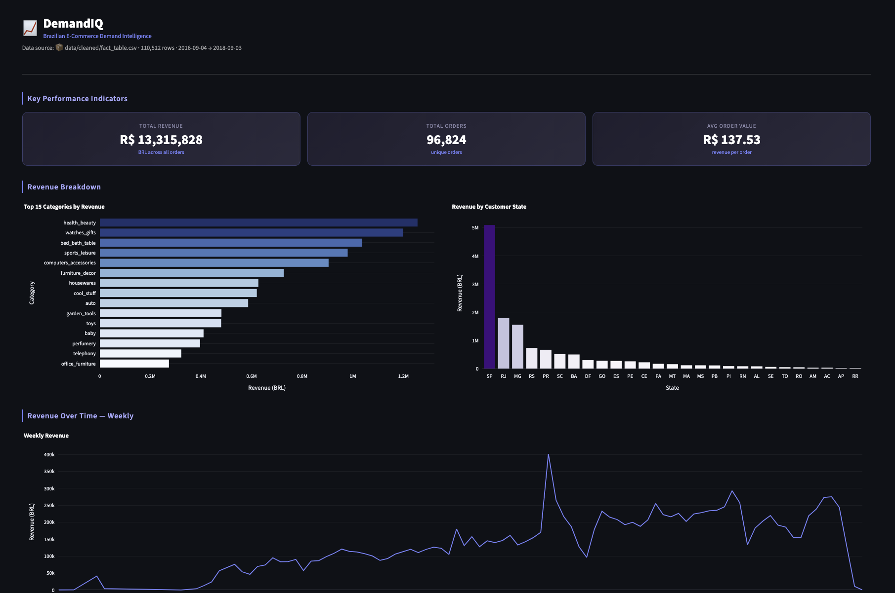
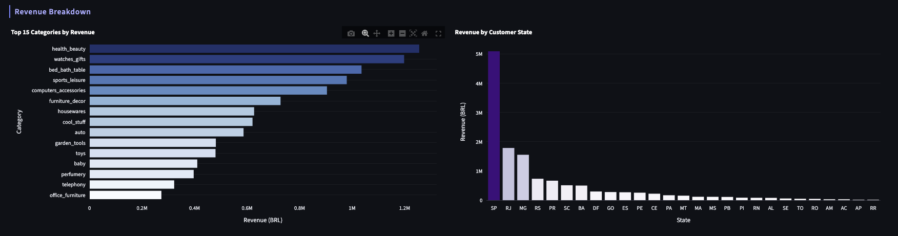
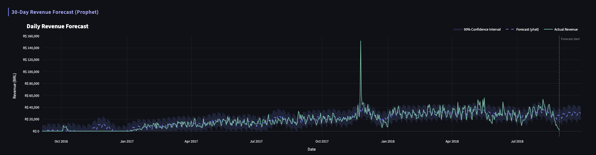
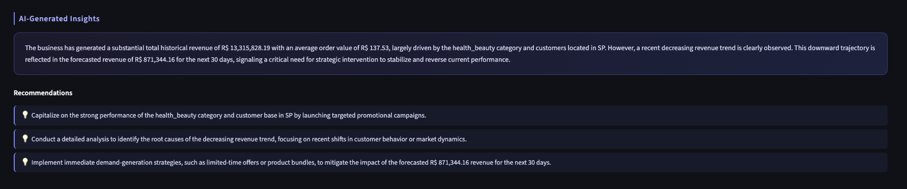

# DemandIQ

**DemandIQ** is an end-to-end retail analytics dashboard that transforms raw e-commerce transaction data into actionable business intelligence. Built on the Olist Brazilian E-Commerce dataset, it computes key performance metrics, visualises revenue trends across categories, states, and time, forecasts the next 30 days of demand using Facebook Prophet, and surfaces natural-language business insights powered by Google's Gemini API. DemandIQ is designed for business analysts, data scientists, and decision-makers who need fast, reliable answers from their sales data — without writing a single line of SQL.

---

## ✨ Features

- **KPI Dashboard** — instant visibility into Total Revenue, Total Orders, and Average Order Value (AOV) for any selected date range.
- **Revenue Breakdown** — horizontal bar charts for top categories and customer states; easily spot your highest-value segments.
- **Time-Series Revenue Chart** — configurable Daily / Weekly / Monthly / Quarterly aggregation to match your reporting cadence.
- **Interactive Filters** — sidebar date-range picker and frequency selector applied globally across all charts.
- **30-Day Demand Forecast** — Prophet model trained on the full historical record, with confidence intervals and a clear forecast-start marker.
- **AI-Generated Insights & Recommendations** — Gemini reads the computed metrics and returns a narrative summary plus prioritised action items.

---

## 🛠 Tech Stack

| Layer | Library |
|---|---|
| Language | Python 3.11+ |
| Data Wrangling | Pandas ≥ 2.1, NumPy ≥ 1.26 |
| Dashboard | Streamlit ≥ 1.35 |
| Charts | Plotly ≥ 5.20 |
| Forecasting | Prophet ≥ 1.1 (Meta) |
| AI Insights | Google Generative AI (Gemini) ≥ 0.7 |
| Config / Secrets | python-dotenv ≥ 1.0 |
| DB (optional) | SQLAlchemy ≥ 2.0 |

---

## 🏗 How It Works

```
Raw CSVs (data/raw/)
    │
    ▼
src/data_loader.py      — loads all Olist tables into memory
    │
    ▼
src/data_processing.py  — joins order_items → orders → products
                          → category_translation → customers
                          → produces fact_table.csv (one row per item)
    │
    ▼
data/cleaned/fact_table.csv   (persisted, ~110 k rows)
    │
    ├── src/metrics.py         — total_revenue, total_orders, AOV,
    │                            revenue_by_category, revenue_by_state,
    │                            revenue_over_time
    │
    ├── src/forecasting.py     — aggregates to daily revenue →
    │                            fits Prophet → 30-day forecast
    │
    └── src/insights.py        — calls Gemini API with computed metrics
                                 → returns insight paragraph + recommendations
    │
    ▼
app.py  (Streamlit dashboard — wires everything above into the UI)
```

**Fact table schema:**
`order_id` · `order_item_id` · `order_date` · `customer_id` · `product_id` · `category` · `quantity` · `price` · `revenue` · `customer_state`

---

## 🚀 Setup Instructions

### 1. Clone the repository

```bash
git clone https://github.com/krishsonvane14/DemandIQ.git
cd DemandIQ
```

### 2. Create and activate a virtual environment

```bash
python -m venv .venv
source .venv/bin/activate   # Windows: .venv\Scripts\activate
```

### 3. Install dependencies

```bash
pip install -r requirements.txt
```

### 4. Create a `.env` file

Create a `.env` file in the project root:

```
GEMINI_API_KEY=your_google_gemini_api_key_here
```

> Get a free API key at [https://aistudio.google.com/app/apikey](https://aistudio.google.com/app/apikey).

### 5. Download the Olist dataset

Download the dataset from Kaggle:  
[Brazilian E-Commerce Public Dataset by Olist](https://www.kaggle.com/datasets/olistbr/brazilian-ecommerce)

Place all CSV files inside `data/raw/`:

```
data/
└── raw/
    ├── olist_orders_dataset.csv
    ├── olist_order_items_dataset.csv
    ├── olist_products_dataset.csv
    ├── olist_customers_dataset.csv
    └── product_category_name_translation.csv
```

### 6. Build the fact table

Run the data processing pipeline once to generate `data/cleaned/fact_table.csv`:

```bash
python -m src.data_processing
```

---

## ▶️ Run the App

```bash
streamlit run app.py
```

The dashboard opens at `http://localhost:8501`.

---

## 🔮 Forecasting & Insights

### Demand Forecasting (Prophet)

The forecasting pipeline aggregates the full transaction history to a daily revenue time series, then fits a [Meta Prophet](https://facebook.github.io/prophet/) model with yearly and weekly seasonality enabled. It generates a 30-day forward projection with a 90% confidence interval.

- Prophet is trained on **unfiltered** historical data — the sidebar date filter is intentionally not applied here, so the model always benefits from the full training set.
- The final 5 days of history are trimmed before training to avoid partial-data trailing effects.

### AI Insights (Gemini)

Insight generation is intentionally **metadata-driven**. Gemini receives a compact dict of pre-computed metrics — total revenue, AOV, top category, top state, revenue trend direction, and 30-day forecast total — rather than raw data rows. This keeps prompts small, responses focused, and API costs low.

The model returns:
- A narrative insight paragraph summarising business performance.
- A list of prioritised, actionable recommendations.

---

## 📸 Screenshots

> Add screenshots to `assets/` after running the app.






---

## 💡 Why This Project Matters

Most analytics tools stop at describing what happened. DemandIQ goes further:

1. **Data-driven decisions at speed** — KPIs, breakdowns, and trends are available the moment data is loaded, with no manual aggregation.
2. **Demand forecasting built in** — Prophet delivers statistically-grounded 30-day projections, giving buyers and planners a concrete number to plan against rather than intuition.
3. **Bridging analytics and language** — Gemini translates computed metrics into plain-English narratives and recommendations, making insights accessible to stakeholders who don't read charts.

DemandIQ demonstrates how modern open-source tooling (Streamlit, Prophet) and frontier AI (Gemini) can be combined into a portfolio-grade analytics product in a single Python codebase.

---

## 📁 Project Structure

```
DemandIQ/
├── app.py                    # Streamlit dashboard entry point
├── config.py                 # Paths, credentials, model defaults
├── requirements.txt
├── .env                      # Not committed — add GEMINI_API_KEY here
├── data/
│   ├── raw/                  # Original Olist CSVs (not committed)
│   └── cleaned/
│       └── fact_table.csv    # Generated by src/data_processing.py
└── src/
    ├── data_loader.py        # Loads raw Olist tables
    ├── data_processing.py    # Builds the cleaned fact table
    ├── metrics.py            # KPI aggregation functions
    ├── forecasting.py        # Prophet pipeline + Plotly chart
    └── insights.py           # Gemini API integration
```

---

## 📄 License

MIT License — see [LICENSE](./LICENSE) for details.
